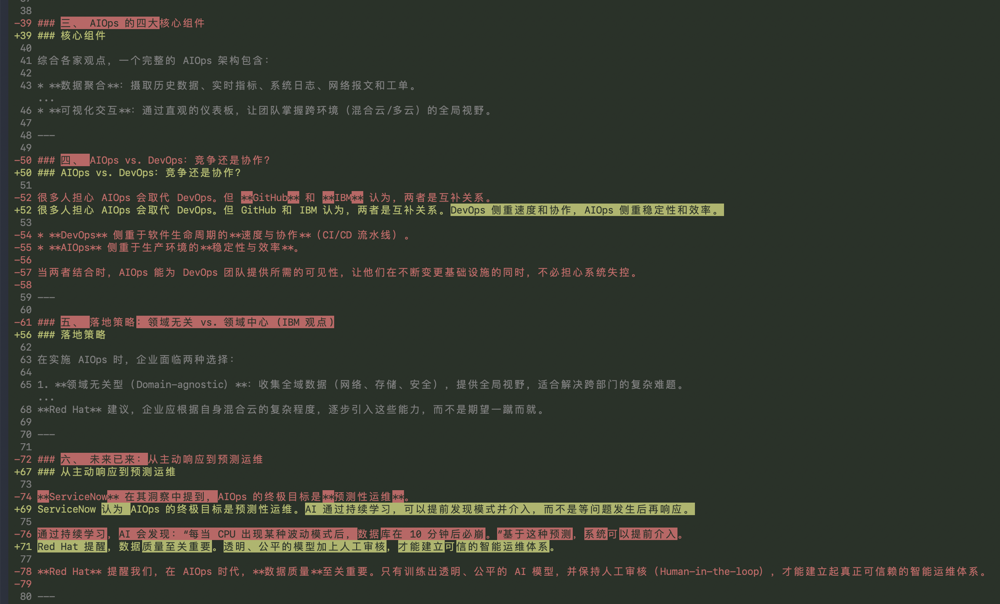
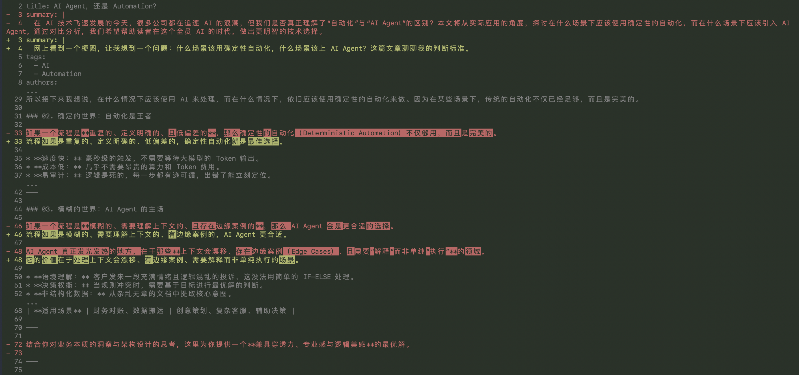

# 去 AI 味

这个 skill 能识别并去除 20 多种中文写作中的 AI 套话模式，也能帮你检测文章是否有 AI 味。

## 效果展示

以下是编辑草稿前后的 git diff 效果：


*红色为 AI 套话原文，绿色为编辑后的版本。可以看到二元对立、废话开头、冒号揭示、伪洞察铺垫等模式被识别并改写。*


*继续展示更多模式的修改效果，包括重要性吹捧、表面分析、虚假强动词、格式套话等。*

## 能识别什么

它检测的模式包括：

| 模式 | 典型表现 |
|------|----------|
| 二元对立 | "这不是X，而是Y。" |
| 废话开头 | "说到底……"、"不得不说……" |
| 伪洞察铺垫 | "很多人不知道的是……" |
| 冒号揭示 | "最关键的一点：它能自我学习。" |
| 表面分析 | "……彰显了团队的决心" |
| 重要性吹捧 | "标志着一个里程碑式的时刻" |
| 模糊引用 | "专家表示"、"研究表明" |
| 虚假强动词 | "充当了一个集中管理的枢纽" |
| 同义词轮换 | 先说"智能体"，再说"助手"，又说"工具" |
| 否定列举 | "不是X。不是Y。而是Z。" |
| 戏剧化碎片 | "就这样。就是这么简单。" |

它还会执行让写作变好的基本原则：该亮观点时直接亮观点、用主动语态、理清难懂的句子、用具体数字替代抽象表述。

## 安装

在 Claude Code、Codex 或你常用的 AI 工具中粘贴：

"全局安装这个 skill：[https://github.com/shenxianpeng/no-ai-slop](https://github.com/shenxianpeng/no-ai-slop)"

## 使用

**1. 编辑草稿。** 粘贴草稿并调用 skill：

```
/no-ai-slop

[你的草稿]
```

你会得到编辑后的草稿和一个简短的「改了什么」部分。这个 skill 只做最小有效修改，然后对照 [eval.md](eval.md) 自检。

**2. 检测 AI 味。** 让它判断一段文字是否有 AI 味：

```
/no-ai-slop 这是 AI 写的吗？

[待检测文本]
```

你会得到它找到的每个模式以及对应的原文引用。

## 文件

1. `SKILL.md`：编辑规则和工作流程。
2. `eval.md`：skill 对自身编辑结果的通过/不通过检查清单。

## 谁做的

这是我个人 AI 操作系统中的一个 skill。完整的工具库，包括课程和工作流，在 [Behind the Craft](https://behindthecraft.com)。

原始英文版来自 [petergyang/no-ai-slop](https://github.com/petergyang/no-ai-slop)。

## 许可证

MIT
